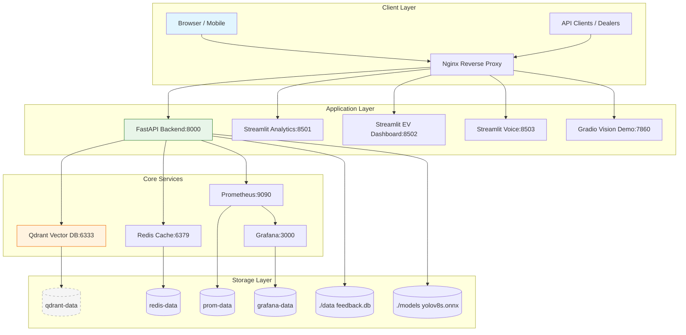
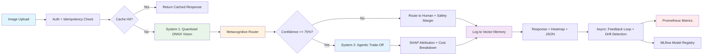
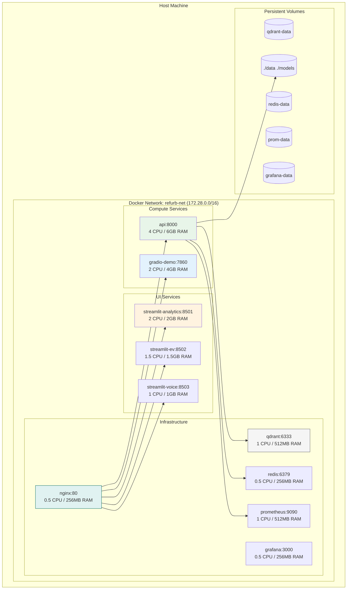

# RefurbCortex
## High level System Architecture

## Dataflow pipeline

## Deterministic Principles layer
```mermaid
graph LR
    subgraph "6 Deterministic Principles"
        P1[Bounded Probabilism] --> V1[Pydantic Validation + Rule Fallbacks]
        P2[Traceability] --> V2[model_sha + prompt_hash + cost_table_version]
        P3[Idempotency] --> V3[X-Idempotency-Key + Redis Cache]
        P4[Graceful Degradation] --> V4[Circuit Breakers + Local Fallbacks]
        P5[Human Sovereignty] --> V5[HITL Override + High-Weight Feedback]
        P6[Data Minimization] --> V6[72h TTL + PII Hashing + Metadata Retention]
    end

    subgraph "Enforcement Points"
        V1 --> E1[API Schema Validation]
        V2 --> E2[Response Metadata + MLflow Tags]
        V3 --> E3[Idempotency Middleware]
        V4 --> E4[Tenacity Retries + Fallback Logic]
        V5 --> E5[/override Endpoint + Feedback Loop]
        V6 --> E6[Privacy Cleanup Cron + Hashing Utils]
    end

    style P1 fill:#e8f5e9,stroke:#2e7d32
    style P2 fill:#e3f2fd,stroke:#1565c0
    style P3 fill:#fff3e0,stroke:#ef6c00
    style P4 fill:#f3e5f5,stroke:#7b1fa2
    style P5 fill:#ffebee,stroke:#c62828
    style P6 fill:#e0f2f1,stroke:#00695c
```

## Deployment Topology


